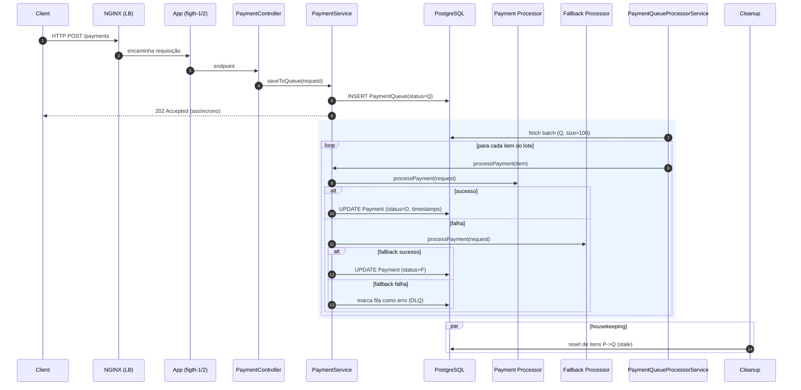

# 🥊 Figth - Spring Boot Application

## 📋 Visão Geral

Aplicação Spring Boot com PostgreSQL, configurada para usar **OpenJDK 21** e **Maven 3.9.11** através do **asdf**.

## 🚀 Configuração Rápida

### 1. Configurar Ambiente
```bash
# Opção 1: Usar comando direto (recomendado)
./init_env

# Opção 2: Usar script completo
./scripts/init-env.sh
```

### 2. Iniciar PostgreSQL
```bash
docker-compose up -d
```

### 3. Executar Aplicação
```bash
mvn spring-boot:run
```

## ⚙️ Configuração do Ambiente

### Pré-requisitos
- **asdf** instalado
- **Docker** e **Docker Compose** instalados
- **OpenJDK 21.0.2** (gerenciado pelo asdf)
- **Maven 3.9.11** (gerenciado pelo asdf)

### Versões Configuradas
- **Java**: OpenJDK 21.0.2
- **Maven**: 3.9.11
- **Spring Boot**: 3.5.4
- **PostgreSQL**: 17.2

## 🔧 Comandos Úteis

### Desenvolvimento
```bash
# Compilar projeto
mvn clean compile

# Executar aplicação
mvn spring-boot:run

# Executar testes
mvn test

# Gerar JAR
mvn clean package
```

### Docker
```bash
# Iniciar PostgreSQL
docker-compose up -d

# Ver logs do PostgreSQL
docker-compose logs postgres

# Parar PostgreSQL
docker-compose down

# Parar e remover volumes
docker-compose down -v
```

### Ambiente
```bash
# Configurar ambiente (forma mais simples)
./init_env

# Ou usar script completo
./scripts/init-env.sh

# Verificar versões
asdf current

# Verificar Java
java -version

# Verificar Maven
mvn --version
```

## 🌐 Endpoints Disponíveis

### Actuator Endpoints
- **Health Check**: `http://localhost:8080/actuator/health`
- **Info**: `http://localhost:8080/actuator/info`
- **Metrics**: `http://localhost:8080/actuator/metrics`
- **Environment**: `http://localhost:8080/actuator/env`

### Exemplo de Health Check
```bash
curl http://localhost:8080/actuator/health | jq .
```

## 🗄️ Banco de Dados

### Configurações
- **Database**: `figth_db`
- **User**: `figth_user`
- **Password**: `figth_password`
- **Porta**: `5432`

### Conexão via Aplicação
```yaml
spring:
  datasource:
    url: jdbc:postgresql://localhost:5432/figth_db
    username: figth_user
    password: figth_password
```

## 📁 Estrutura do Projeto

```
├── src/
│   ├── main/
│   │   ├── java/
│   │   │   └── com/backend/figth/
│   │   │       └── FigthApplication.java
│   │   └── resources/
│   │       └── application.yml
│   └── test/
├── scripts/
│   ├── init-env.sh          # Script de inicialização
│   ├── dev-setup.sh         # Script de configuração
│   └── setup-alias.sh       # Script para configurar alias
├── postgres-config/
│   └── postgresql.conf      # Configurações do PostgreSQL
├── init-scripts/
│   └── 01-init.sql         # Scripts de inicialização
├── docker-compose.yml       # Configuração Docker
├── .tool-versions          # Versões do asdf
├── init_env               # Comando de inicialização
├── pom.xml                # Dependências Maven
└── README.md              # Este arquivo
```

## 🔍 Troubleshooting

### Problema: Java não encontrado
```bash
# Verificar se asdf está configurado
asdf current

# Recarregar configuração
source ~/.zshrc

# Ou usar comando de inicialização
./init_env
```

### Problema: PostgreSQL não conecta
```bash
# Verificar se Docker está rodando
docker ps

# Iniciar PostgreSQL
docker-compose up -d

# Verificar logs
docker-compose logs postgres
```

### Problema: Porta 8080 ocupada
```bash
# Verificar processos na porta
lsof -i :8080

# Matar processo se necessário
kill -9 <PID>
```

## 📊 Monitoramento

A aplicação inclui **Spring Boot Actuator** com:
- ✅ Health checks detalhados
- 📈 Métricas de aplicação
- 🔧 Informações do ambiente
- 📋 Status dos componentes

## 🛠️ Tecnologias

- **Spring Boot 3.5.4**
- **Spring Data JPA**
- **Spring Cloud OpenFeign**
- **PostgreSQL 17.2**
- **Docker & Docker Compose**
- **asdf** (Version Manager)
- **OpenJDK 21**
- **Maven 3.9.11**
- **Lombok** 

## 🧱 Arquitetura e Operação

- **Topologia**: 2 instâncias da aplicação (`figth-1`, `figth-2`) atrás de um **NGINX** (balanceador), 1 **PostgreSQL**. Alvo: **~500 TPS** com **~1.5 vCPU** e **~350 MB RAM** somados.
- **Tecnologias-chave**: Spring Boot 3, Spring Cloud OpenFeign, Spring Data JPA, HikariCP, Actuator, GraalVM Native Image, NGINX, PostgreSQL.
- **Estilo**: Stateless HTTP API + fila baseada em banco para desacoplamento de escrita e processamento.

### Componentes
- **NGINX**: balanceia entre `figth-1` e `figth-2` (round-robin), mantém keep-alive e limita conexões.
- **Aplicação (figth)**:
  - `PaymentController`: recebe requisições de pagamento.
  - `PaymentService`: persiste na fila (`PaymentQueue`), processa lotes, chama processador principal e fallback via **OpenFeign**.
  - `PaymentQueueProcessorService`: consome lotes da fila (batch), coordena chamadas e marcações de status.
  - `PaymentPersistenceService`: persistência de `Payment` e `PaymentQueue` (JPA/Hibernate) com batch.
  - `StaleProcessingCleanupService`: reverte itens travados/antigos de volta à fila.
  - `AsyncConfig`: executor nomeado `taskExecutor` para métodos `@Async` e suporte a virtual threads quando habilitado.
- **PostgreSQL**: armazenamento de fila (`PaymentQueue`) e pagamentos (`Payment`).
- **Payment Processor / Fallback**: serviços externos acessados via Feign, com timeouts e fallback explícito.

### Fluxo (Sequência)


### Decisões de Arquitetura
- **Assíncrono por padrão**: requisições retornam 202; o trabalho pesado roda em background por lote.
- **Fila em banco**: simplifica operação, garante atomicidade com a própria transação do domínio.
- **Fallback explícito**: segundo processador via Feign para resiliência.
- **Batch + JPA**: `hibernate.jdbc.batch_size=100`, `order_inserts/updates=true` para reduzir roundtrips.
- **Threading**: `@Async("taskExecutor")` dedicado; suporte a virtual threads habilitável (`spring.threads.virtual.enabled=true`).
- **Container nativo**: build com GraalVM para reduzir memória e tempo de arranque, cabendo no orçamento.
- **Logging econômico**: níveis reduzidos em produção para poupar CPU/IO.

### Desafios e Soluções
- **500 TPS com ~1.5 vCPU / ~350 MB RAM**
  - Soluções: imagem nativa (GraalVM), logs mínimos, conexões HTTP keep-alive, latência de DB amortizada via batch.
- **Pressão em banco (picos de escrita/leitura)**
  - Soluções: lote (`batch_size=100`), ordenação de operações, índices adequados em colunas de fila/status/tempo.
- **Resiliência a falhas do processador externo**
  - Soluções: timeouts Feign, cliente de fallback, marcação clara de estados (`D` direto, `F` fallback, DLQ em falhas).
- **Itens travados (stale) em processamento**
  - Soluções: `StaleProcessingCleanupService` reclassifica registros antigos para nova tentativa.
- **Uso de threads sob pouca memória**
  - Soluções: executor dedicado + virtual threads, evitando bloqueios longos e maximizando concorrência leve.
- **Contenção de conexões**
  - Soluções: HikariCP tunado (pool, idle/timeout), `connection-test-query` leve, `max-lifetime` abaixo do TTL do LB/DB.

### Capacidades Operacionais
- **Escala horizontal**: adicionar mais instâncias atrás do NGINX é linear para throughput.
- **Rollouts seguros**: instâncias stateless; NGINX permite drenar conexões.
- **Observabilidade**: Actuator (health, metrics, env); padrões de log com timestamp/thread.

### Parâmetros Relevantes (ilustração)
- Compose atual indica limites aproximados por serviço:
  - `figth-1`/`figth-2`: `cpus: 0.4`, `memory: 90M` cada
  - `nginx`: `cpus: 0.1`, `memory: 10M`
  - `postgres`: `cpus: 0.6`, `memory: 160M`
- Total aproximado: ~1.5 vCPU e ~350 MB RAM.

### Quando ajustar
- Aumentar `batch_size` se latência de DB for baixa e CPU ociosa.
- Reduzir logs se houver saturação de IO.
- Ajustar pool Hikari conforme throughput/conexões simultâneas. 